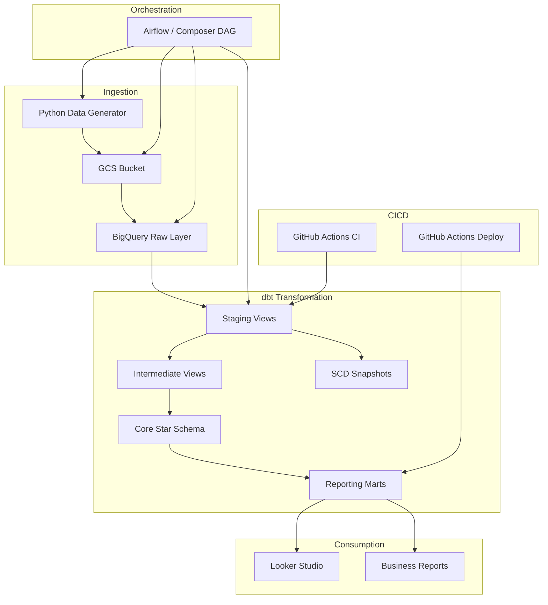

# RetailPulse

**RetailPulse** is a production-style e-commerce analytics engineering platform built on **Google BigQuery** and **dbt Core**. It ingests synthetic retail data, transforms it through a medallion architecture, and produces trusted reporting tables ready for **Looker Studio** dashboards.

## Architecture



## Business Questions Answered

| Question | Mart / Model |
|----------|-------------|
| Daily, weekly, monthly sales trends | `mart_daily_sales` |
| Top products and categories by revenue | `mart_product_performance` |
| High-value, inactive, at-risk customers | `mart_customer_360` |
| Average order value and repeat rate | `mart_customer_360`, `mart_customer_retention` |
| Product return rates | `mart_product_performance` |
| Marketing campaign ROI | `mart_campaign_roi` |
| Regional revenue and growth | `mart_regional_sales` |

## BigQuery Dataset Design

| Dataset | Layer | Purpose |
|---------|-------|---------|
| `retailpulse_raw` | Raw | CSV data loaded from GCS |
| `retailpulse_staging` | Staging | Cleaned, deduplicated views |
| `retailpulse_intermediate` | Intermediate | Enriched business logic |
| `retailpulse_analytics` | Core | Star schema dimensions & facts |
| `retailpulse_reporting` | Reporting | Looker Studio-ready marts |
| `retailpulse_snapshots` | Snapshots | SCD Type 2 history |

Environments (`dev`, `qa`, `prod`) are supported via the `DBT_TARGET` variable and `profiles.yml`.

## Prerequisites

- Python 3.11+
- Google Cloud SDK (`gcloud`)
- A GCP project with billing enabled
- Service account with appropriate IAM roles
- Git

## GCP APIs to Enable

```bash
gcloud services enable \
  bigquery.googleapis.com \
  storage.googleapis.com \
  iam.googleapis.com \
  composer.googleapis.com \
  --project=YOUR_PROJECT_ID
```

## Service Account Roles

| Role | Purpose |
|------|---------|
| `roles/bigquery.dataEditor` | Read/write BigQuery tables |
| `roles/bigquery.jobUser` | Run BigQuery jobs |
| `roles/storage.objectAdmin` | Upload/download GCS objects |

## Local Setup

### 1. Clone and configure

```bash
cd ~/Projects/retailpulse-bigquery-dbt
cp .env.example .env
# Edit .env with your GCP project ID, bucket name, and credentials path
```

### 2. Python virtual environment

```bash
make setup
# or manually:
python3 -m venv .venv
source .venv/bin/activate
pip install -r requirements.txt
```

### 3. BigQuery authentication

**Option A — Service account key:**
```bash
export GOOGLE_APPLICATION_CREDENTIALS=/path/to/service-account-key.json
```

**Option B — Application Default Credentials:**
```bash
gcloud auth application-default login
```

### 4. dbt profiles

```bash
cp dbt_project/profiles.yml.example dbt_project/profiles.yml
```

### 5. Validate environment

```bash
make validate
```

## Running the Pipeline

### Generate synthetic data

```bash
make generate
# or with custom counts:
python scripts/generate_sample_data.py \
  --customers 5000 \
  --products 500 \
  --orders 50000 \
  --order-items 100000 \
  --web-events 200000
```

### Upload to GCS

```bash
make upload
```

### Create BigQuery datasets

```bash
make create-datasets
```

### Load raw data into BigQuery

```bash
# From GCS (default)
make load

# From local CSV files (no GCS required)
LOAD_FROM_LOCAL=true make load
```

### Full pipeline

```bash
make pipeline
```

## dbt Commands

```bash
# Install dbt packages
make dbt-deps

# Run all models
make dbt-run

# Run tests
make dbt-test

# Build (models + tests + snapshots)
make dbt-build

# Generate documentation
make dbt-docs
# View docs locally:
cd dbt_project && dbt docs serve --profiles-dir .
```

### Run specific layers

```bash
cd dbt_project
dbt run --select staging --profiles-dir .
dbt run --select intermediate --profiles-dir .
dbt run --select marts.core --profiles-dir .
dbt run --select marts.reporting --profiles-dir .
```

## Terraform Deployment

```bash
cd infrastructure/terraform

# Create terraform.tfvars
cat > terraform.tfvars <<EOF
project_id   = "your-gcp-project-id"
region       = "us-central1"
environment  = "dev"
bucket_name  = "retailpulse-data-dev"
dataset_prefix = "retailpulse"
EOF

terraform init
terraform plan
terraform apply
```

## Airflow / Composer Deployment

1. Deploy Terraform infrastructure (GCS bucket, datasets, service account).
2. Copy project files to Composer DAGs bucket:
   ```bash
   gsutil -m cp -r airflow/dags/* gs://YOUR_COMPOSER_BUCKET/dags/
   gsutil -m cp -r dbt_project gs://YOUR_COMPOSER_BUCKET/dags/
   gsutil -m cp -r scripts gs://YOUR_COMPOSER_BUCKET/dags/
   ```
3. Set Composer environment variables:
   - `GCP_PROJECT_ID`
   - `GCS_BUCKET_NAME`
   - `DBT_DATASET_PREFIX`
   - `DBT_TARGET`
   - `AIRFLOW_ENV`
4. Enable the `retailpulse_pipeline` DAG in the Airflow UI.

For local Airflow testing:
```bash
docker-compose up airflow
# Open http://localhost:8080
```

## Looker Studio Recommendations

Connect Looker Studio to the `retailpulse_reporting` dataset:

| Dashboard | Data Source | Key Metrics |
|-----------|------------|-------------|
| Executive Sales | `mart_daily_sales` | net_sales, AOV, return_rate |
| Customer 360 | `mart_customer_360` | CLV, segment, churn_risk_flag |
| Product Analytics | `mart_product_performance` | units sold, margin, return_rate |
| Marketing ROI | `mart_campaign_roi` | ROI %, cost_per_order |
| Retention | `mart_customer_retention` | cohort retention_rate |
| Regional | `mart_regional_sales` | net_sales by geography |

## Troubleshooting

| Issue | Solution |
|-------|----------|
| `403 Forbidden` on BigQuery | Verify service account IAM roles |
| `Dataset not found` | Run `make create-datasets` |
| dbt `profile not found` | Copy `profiles.yml.example` to `profiles.yml` |
| GCS upload fails | Check bucket exists and SA has `storage.objectAdmin` |
| dbt compile errors | Run `dbt deps` first |
| Incremental model issues | Check `incremental_lookback_days` var in `dbt_project.yml` |

## BigQuery Cost Optimization

- Use **partitioned** fact tables (`order_date`, `event_date`, `return_date`)
- **Cluster** on high-cardinality filter columns (`customer_id`, `product_id`)
- Staging/intermediate layers are **views** (no storage cost)
- Set `limit_data_in_dev` macro for dev environment testing
- Use `WRITE_TRUNCATE` for raw loads in dev; incremental in prod
- Enable **slot reservations** only for production workloads
- Monitor query costs in BigQuery audit logs

## Project Resume Bullets

- Built end-to-end analytics platform processing 50K+ orders and 200K+ web events on BigQuery
- Designed medallion architecture with 6 BigQuery datasets and 30+ dbt models
- Implemented star schema with partitioned/clustered fact tables and incremental merge strategy
- Created SCD Type 2 snapshots for customer and product dimension tracking
- Built CI/CD pipeline with GitHub Actions for dbt parse, compile, test, and production deploy
- Developed Airflow DAG for daily orchestration compatible with Cloud Composer
- Provisioned GCP infrastructure (GCS, BigQuery, IAM) using Terraform

## Interview Questions & Answers

**Q: Why use a medallion architecture?**
A: It provides clear separation of concerns — raw data preservation, cleaned staging, reusable intermediate logic, and business-ready marts. Each layer can be tested and maintained independently.

**Q: Why partition and cluster BigQuery tables?**
A: Partitioning by date reduces bytes scanned for time-filtered queries. Clustering on `customer_id` or `product_id` further optimizes filter performance within partitions.

**Q: When would you use incremental models vs full refresh?**
A: Incremental for large, append-heavy tables like `fct_order_items` and `fct_web_events`. Full refresh for small dimensions or when logic changes require rebuilding history.

**Q: How do you handle late-arriving data?**
A: The `incremental_lookback_days` variable (default 7) reprocesses recent partitions on each run, catching records that arrive after their event date.

**Q: How do you ensure data quality?**
A: dbt tests (unique, not_null, relationships, accepted_values), custom SQL tests for business rules, source freshness checks, and SCD snapshots for change tracking.

## License

MIT
