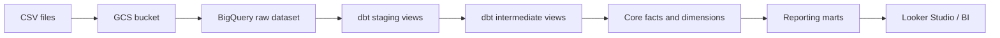

# RetailPulse Live Class Walkthrough

This guide is designed for a live class where students first build the pipeline manually in the GCP Console, then repeat the same work using automation.

Use this order:

1. Explain the business problem.
2. Build the raw layer manually in GCP Console.
3. Inspect data in BigQuery.
4. Explain why manual work does not scale.
5. Run the automated Python + dbt pipeline.
6. Compare the final analytics tables with the manual raw layer.

## 0. Story To Tell Students

RetailPulse is an e-commerce analytics platform.

The company has data from:

- customers
- products
- categories
- orders
- order items
- payments
- returns
- web events
- marketing campaigns

The business wants answers like:

- How much revenue did we make each day?
- Which products perform best?
- Which customers are high value or at risk?
- Which marketing campaigns generated ROI?
- Which regions produce the most sales?

The engineering goal is to turn raw CSV data into trusted BigQuery reporting tables using dbt.

## 1. Architecture Explanation

Draw this on the board before touching GCP:



Explain the layers:

- Raw: preserve source data as loaded.
- Staging: clean names, cast types, deduplicate.
- Intermediate: reusable joins and business logic.
- Core: facts and dimensions.
- Reporting: final business-ready tables.

## 2. Prerequisites Before Class

Teacher machine:

- Google Cloud SDK installed
- Python 3.11 installed
- GCP project with billing enabled
- BigQuery API enabled
- Cloud Storage API enabled
- Authenticated with `gcloud auth login`
- Authenticated for Python/dbt with `gcloud auth application-default login`

Recommended class environment variables:

```powershell
$env:GCP_PROJECT_ID="your-gcp-project-id"
$env:GCP_REGION="us-central1"
$env:GCS_BUCKET_NAME="your-unique-retailpulse-bucket"
$env:DBT_DATASET_PREFIX="retailpulse"
$env:DBT_TARGET="dev"
```

## 3. Part One: Manual Console Build

Goal: students understand what each automated script will later do.

### Step 1: Open GCP Console

Open:

```text
https://console.cloud.google.com/
```

Select the target project.

Explain:

- A GCP project is the billing and security boundary.
- BigQuery datasets and GCS buckets live inside this project.

### Step 2: Enable APIs

In the GCP Console:

1. Go to `APIs & Services`.
2. Open `Library`.
3. Enable `BigQuery API`.
4. Enable `Cloud Storage API`.

Explain:

- BigQuery is the warehouse.
- Cloud Storage is the raw file landing zone.

Command equivalent:

```powershell
gcloud services enable bigquery.googleapis.com storage.googleapis.com --project=$env:GCP_PROJECT_ID
```

### Step 3: Create A GCS Bucket

In the GCP Console:

1. Go to `Cloud Storage`.
2. Click `Buckets`.
3. Click `Create`.
4. Use a globally unique bucket name, for example:

```text
retailpulse-data-yourname-dev
```

5. Choose region: `us-central1`.
6. Keep standard storage.
7. Use uniform bucket-level access.
8. Create the bucket.

Explain:

- Buckets are global names.
- We use the bucket as the raw landing zone.
- In production, external systems would drop files here.

### Step 4: Generate CSV Files Locally

From the repo root:

```powershell
.\.venv\Scripts\python.exe scripts\generate_sample_data.py --customers 500 --products 100 --orders 2000 --order-items 5000 --web-events 10000
```

Show students the generated folder:

```text
data/sample_data/
```

Explain each file:

- `customers.csv`: customer master data
- `products.csv`: product catalog
- `orders.csv`: order headers
- `order_items.csv`: order line items
- `web_events.csv`: clickstream events
- `marketing_campaigns.csv`: campaign metadata

### Step 5: Upload Files Manually To GCS

In the bucket:

1. Create a folder named `raw`.
2. Upload the CSV files from:

```text
data/sample_data/
```

Explain:

- We are simulating an ingestion landing zone.
- The path convention is `gs://bucket/raw/table_name.csv`.

Command equivalent:

```powershell
gsutil cp data/sample_data/*.csv gs://$env:GCS_BUCKET_NAME/raw/
```

### Step 6: Create BigQuery Datasets Manually

In BigQuery Console:

1. Open `BigQuery`.
2. Select the project.
3. Click `Create dataset`.
4. Create these datasets:

```text
retailpulse_raw
retailpulse_staging
retailpulse_intermediate
retailpulse_analytics
retailpulse_reporting
retailpulse_snapshots
```

Use location: `us-central1`.

Explain:

- Each dataset maps to one pipeline layer.
- Dataset separation makes governance, cost tracking, and permissions easier.

### Step 7: Load One CSV Manually

In BigQuery:

1. Open `retailpulse_raw`.
2. Click `Create table`.
3. Source: `Google Cloud Storage`.
4. Choose one file:

```text
gs://your-bucket/raw/customers.csv
```

5. File format: `CSV`.
6. Destination table: `customers`.
7. Check `Header rows to skip`: `1`.
8. Use schema auto-detect for the demo.
9. Create table.

Then run:

```sql
select *
from `your-project.retailpulse_raw.customers`
limit 10;
```

Explain:

- This is the raw table.
- It is useful, but it is not yet analytics-ready.
- Manual schema decisions can become inconsistent across many tables.

### Step 8: Show Why Manual Work Is Painful

Ask students:

- Do we want to click through this for 9 tables?
- What if the data arrives daily?
- What if we need dev, QA, and prod?
- How do we test quality?
- How do we document transformations?

This tees up automation.

## 4. Part Two: Automation Build

Goal: automate everything we just did manually.

### Step 1: Configure `.env`

Create `.env` from `.env.example`:

```powershell
Copy-Item .env.example .env
```

Edit:

```text
GCP_PROJECT_ID=your-gcp-project-id
GCP_REGION=us-central1
GCS_BUCKET_NAME=your-unique-retailpulse-bucket
DBT_DATASET_PREFIX=retailpulse
DBT_TARGET=dev
```

Explain:

- `.env` keeps environment-specific configuration outside code.
- The same code can deploy to dev, QA, or prod.

### Step 2: Create Virtual Environment

On Windows PowerShell:

```powershell
py -3.11 -m venv .venv
.\.venv\Scripts\python.exe -m pip install --upgrade pip
.\.venv\Scripts\python.exe -m pip install google-cloud-bigquery google-cloud-storage google-auth Faker pandas dbt-core dbt-bigquery python-dotenv click sqlfluff sqlfluff-templater-dbt
```

Explain:

- The virtual environment isolates project dependencies.
- dbt-bigquery lets dbt talk to BigQuery.

### Step 3: Authenticate

```powershell
gcloud auth login
gcloud auth application-default login
```

Explain:

- `gcloud auth login` authenticates CLI commands.
- `application-default login` authenticates Python libraries and dbt.

### Step 4: Validate Environment

```powershell
$env:GCP_PROJECT_ID="your-gcp-project-id"
$env:GCP_REGION="us-central1"
$env:GCS_BUCKET_NAME="your-unique-retailpulse-bucket"
$env:DBT_DATASET_PREFIX="retailpulse"
$env:DBT_TARGET="dev"

.\.venv\Scripts\python.exe scripts\validate_environment.py
```

Expected result:

```text
Environment validation passed.
```

### Step 5: Generate Data Automatically

```powershell
.\.venv\Scripts\python.exe scripts\generate_sample_data.py --customers 500 --products 100 --orders 2000 --order-items 5000 --web-events 10000
```

Explain:

- This creates a repeatable synthetic dataset.
- Counts can be increased for performance demos.

### Step 6: Upload To GCS Automatically

```powershell
.\.venv\Scripts\python.exe scripts\upload_to_gcs.py
```

Explain:

- This replaces manual browser uploads.
- The script uses a fixed `raw/` landing path.

### Step 7: Create BigQuery Datasets Automatically

```powershell
.\.venv\Scripts\python.exe scripts\create_bigquery_datasets.py
```

Explain:

- This replaces manually creating six datasets.
- Dataset names are derived from `DBT_DATASET_PREFIX`.

### Step 8: Load Raw Data Automatically

```powershell
.\.venv\Scripts\python.exe scripts\load_raw_data_to_bigquery.py
```

Explain:

- This loads all 9 CSV files.
- It uses explicit schemas.
- It adds ingestion metadata:
  - `_ingested_at`
  - `_source_file`
  - `_batch_id`

Verify:

```sql
select count(*) from `your-project.retailpulse_raw.orders`;
select count(*) from `your-project.retailpulse_raw.order_items`;
```

### Step 9: Configure dbt Profile

For live class, use OAuth profile:

```yaml
retailpulse:
  target: dev
  outputs:
    dev:
      type: bigquery
      method: oauth
      project: "{{ env_var('GCP_PROJECT_ID') }}"
      dataset: "{{ env_var('DBT_DATASET_PREFIX', 'retailpulse') }}_staging"
      location: "{{ env_var('GCP_REGION', 'us-central1') }}"
      threads: 4
      priority: interactive
      job_execution_timeout_seconds: 300
      job_retries: 1
```

Save as:

```text
dbt_project/profiles.yml
```

Explain:

- dbt needs a profile to know how to connect to BigQuery.
- `dataset` is the default dataset, but this project overrides schemas by layer.

### Step 10: Install dbt Packages

```powershell
cd dbt_project
..\ .venv\Scripts\dbt.exe deps --profiles-dir .
```

If copying the command, remove the space between `..\` and `.venv`:

```powershell
..\.venv\Scripts\dbt.exe deps --profiles-dir .
```

Explain:

- `dbt deps` installs packages from `packages.yml`.
- This project uses `dbt_utils`.

### Step 11: Test dbt Connection

```powershell
..\.venv\Scripts\dbt.exe debug --profiles-dir .
```

Expected:

```text
All checks passed!
```

### Step 12: Build Everything

```powershell
..\.venv\Scripts\dbt.exe build --profiles-dir . --no-partial-parse
```

Explain:

- `dbt build` runs models, tests, seeds, and snapshots where applicable.
- In this project it builds staging, intermediate, core, reporting, tests, and snapshots.

Expected:

```text
Completed successfully
PASS=135 WARN=0 ERROR=0 SKIP=0 TOTAL=135
```

### Step 13: Source Freshness

```powershell
..\.venv\Scripts\dbt.exe source freshness --profiles-dir .
```

Explain:

- Source freshness checks whether raw data was loaded recently.
- This helps detect broken upstream ingestion.

### Step 14: Generate dbt Docs

```powershell
..\.venv\Scripts\dbt.exe docs generate --profiles-dir .
..\.venv\Scripts\dbt.exe docs serve --profiles-dir .
```

Explain:

- dbt docs show lineage, model descriptions, columns, and tests.
- This is how analytics engineering becomes discoverable.

## 5. Final Queries To Show Students

Daily sales:

```sql
select
  sales_date,
  total_orders,
  total_customers,
  net_sales,
  average_order_value,
  return_rate
from `your-project.retailpulse_reporting.mart_daily_sales`
order by sales_date desc
limit 20;
```

Customer 360:

```sql
select
  customer_id,
  customer_name,
  total_orders,
  total_spend,
  customer_segment,
  churn_risk_flag
from `your-project.retailpulse_reporting.mart_customer_360`
order by total_spend desc
limit 20;
```

Product performance:

```sql
select
  product_name,
  category_name,
  total_units_sold,
  net_sales,
  profit_margin_percentage,
  product_performance_segment
from `your-project.retailpulse_reporting.mart_product_performance`
order by net_sales desc
limit 20;
```

Campaign ROI:

```sql
select
  campaign_name,
  channel,
  budget_amount,
  attributed_orders,
  attributed_revenue,
  roi_percentage
from `your-project.retailpulse_reporting.mart_campaign_roi`
order by roi_percentage desc
limit 20;
```

## 6. Teaching Points By Layer

Raw:

- Loaded exactly from source files.
- Includes ingestion metadata.
- Not meant for business users.

Staging:

- One model per source.
- Type casting.
- String cleanup.
- Deduplication.
- Standard naming.

Intermediate:

- Joins and reusable logic.
- Revenue calculations.
- Customer/product/campaign summaries.

Core:

- Star schema.
- Dimensions and facts.
- Partitioned and clustered facts.

Reporting:

- Final BI-ready tables.
- One table per business question.

Snapshots:

- Track slowly changing customer and product records.

## 7. Automation Summary

Manual work:

```text
Create bucket -> upload files -> create datasets -> create tables -> write SQL manually
```

Automated work:

```text
generate_sample_data.py
upload_to_gcs.py
create_bigquery_datasets.py
load_raw_data_to_bigquery.py
dbt build
```

Classroom message:

Manual build teaches the concepts.

Automation makes it repeatable, testable, and production-ready.

## 8. Common Live Demo Issues

Permission denied:

- Check active account:

```powershell
gcloud auth list
gcloud config get-value project
```

- Check ADC:

```powershell
gcloud auth application-default print-access-token
```

Bucket name already exists:

- Bucket names are global.
- Add your initials, date, or project suffix.

dbt cannot find profile:

- Confirm `dbt_project/profiles.yml` exists.
- Run dbt with:

```powershell
dbt debug --profiles-dir .
```

BigQuery dataset not found:

- Run:

```powershell
.\.venv\Scripts\python.exe scripts\create_bigquery_datasets.py
```

CSV load fails on integer columns:

- Regenerate data with the fixed generator.
- Nullable integer IDs must not be serialized as `1.0`, `2.0`, etc.

## 9. Suggested Class Timing

Total: 90 to 120 minutes.

- 10 min: business problem and architecture
- 20 min: manual GCS and BigQuery console build
- 10 min: inspect raw data and discuss limitations
- 20 min: automation scripts
- 20 min: dbt build and tests
- 10 min: docs, lineage, and final marts
- 10 min: Q&A and interview framing

## 10. Closing Explanation

End with this summary:

RetailPulse shows the difference between loading data and engineering analytics.

Loading data gets CSVs into BigQuery.

Analytics engineering creates reliable, tested, documented, business-ready datasets.

That is what dbt adds on top of BigQuery.
